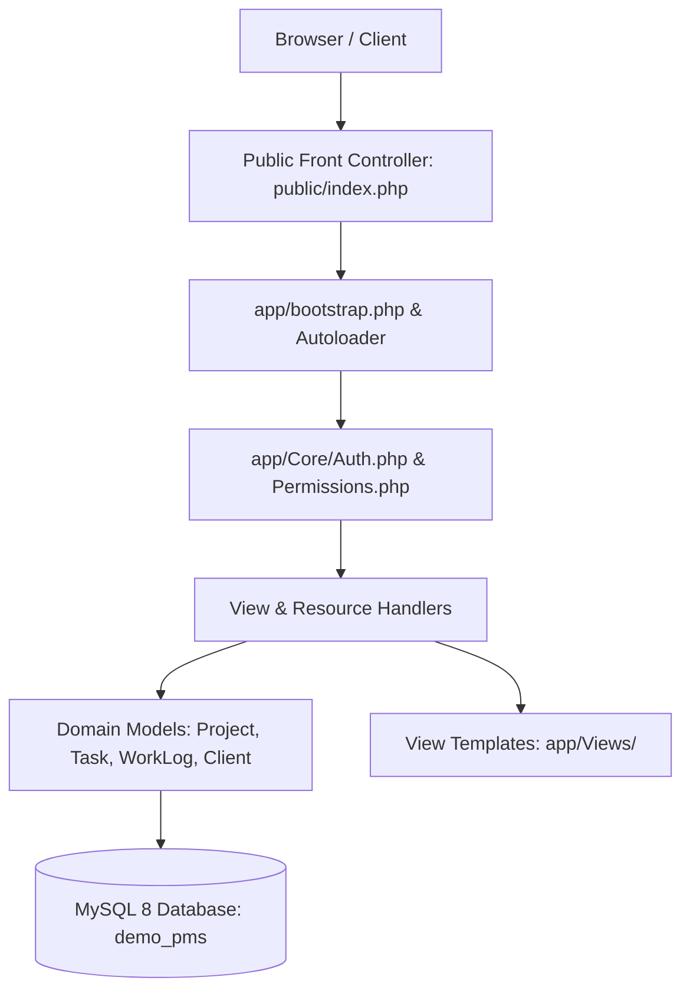

# Enterprise PMS — Project, Sprint & Timesheet Platform

[](https://www.php.net)
[](https://www.mysql.com)
[](#demo-access-credentials)
[](#)

A high-performance **Enterprise Project Management System (PMS)** engineered in clean PHP MVC. Delivers end-to-end client portfolio governance, sprint phase lifecycles, interactive Kanban boards, employee timesheet tracking, and executive XLSX export capabilities.

---

## 🌟 Architecture & Core Capabilities

### 1. Robust MVC Pattern
- **Core Engine (`app/Core/`)**: Custom lightweight router, authentication sessions, permission gates, and database connection pooling.
- **Data Models (`app/Models/`)**: Active-record style abstractions for `Client`, `Project`, `Task`, `WorkLog`, `Dashboard`, and `TimesheetXlsxExporter`.
- **Modular Views (`app/Views/`)**: Component-based layouts for dashboards, Kanban views, task inspectors, and user profiles.

### 2. Project Lifecycle & Sprint Management
- Multi-client portfolio organization with budget and delivery health tracking.
- Phased delivery breakdowns (Discovery & Scoping &rarr; Wireframing & UX &rarr; High-Fidelity Design &rarr; QA & Client Handover).
- Interactive Kanban state boards with drag-and-drop status transitions (`Todo`, `In Progress`, `Review`, `Done`).

### 3. Resource Allocation & Timesheet Audit
- Granular task delegation with priority metrics and deadline alerts.
- Employee daily/weekly work log recording with task linkage and hourly audits.
- Automated timesheet compilation and XLSX export engine.

---

## 🔐 Demo Access Credentials

Unified portfolio demo password: `Demo@2026!`

| Role | Email Address | Password | Permissions Scope |
| :--- | :--- | :--- | :--- |
| **Super Admin** | `admin@pms.demo` | `Demo@2026!` | Complete portfolio governance, user provisioning, global reporting |
| **Project Lead** | `pm@pms.demo` | `Demo@2026!` | Sprint planning, task assignment, phase tracking, timesheet review |
| **Developer / Designer**| `dev@pms.demo` | `Demo@2026!` | Task execution, Kanban updates, work log time tracking |

---

## 🏗️ System Architecture



### Relational Database Schema (12 Tables)
- `users`: User identity, hashed credentials, roles, and status.
- `clients`: Enterprise client accounts.
- `projects`: Budgets, start/end dates, client IDs, and project status.
- `phases`: Multi-tier sprint milestones.
- `tasks`: Task specifications, assignees, priorities, and Kanban columns.
- `work_logs`: Timesheet entries, duration, activity date, and approval notes.
- `custom_fields` & `project_field_settings`: Extensible schema attributes.

---

## 🚀 Quick Start & Local Setup (XAMPP / Apache)

### 1. Clone the Repository
```bash
git clone https://github.com/swapnil0607/pms-portal.git pms
```

### 2. Create Database
```sql
CREATE DATABASE demo_pms CHARACTER SET utf8mb4 COLLATE utf8mb4_unicode_ci;
```

### 3. Import Schemas & Dummy Seed Data
```bash
mysql -u root demo_pms < database/schema_clean.sql
mysql -u root demo_pms < database/seed_dummy.sql
```

### 4. Run Application
Navigate to `http://localhost/pms/` in your browser and log in with any demo account listed above.

---

## 🛡️ Security & Sanitization Notice
This repository contains **100% synthetic dummy data**. All corporate clients, developer names, email addresses, and work log entries have been generated strictly for showcase and technical evaluation. All third-party SMS/mailer credentials and raw production databases have been excluded via `.gitignore`.
